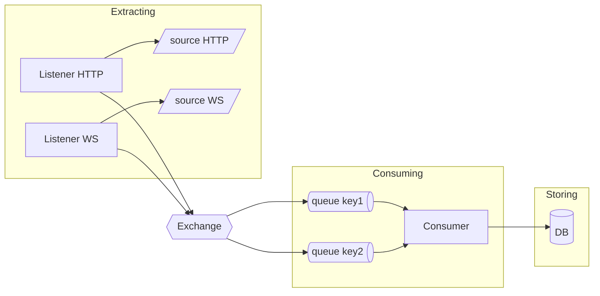
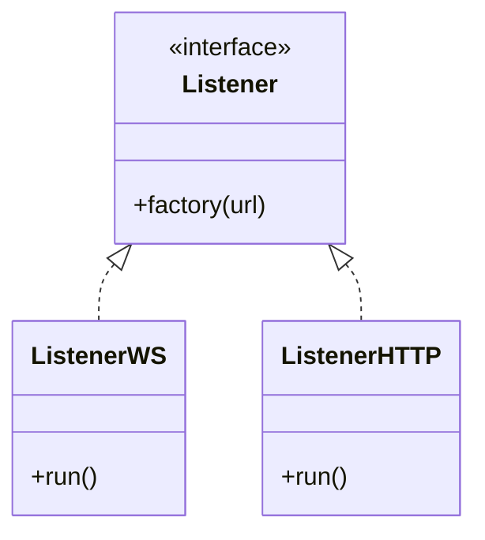
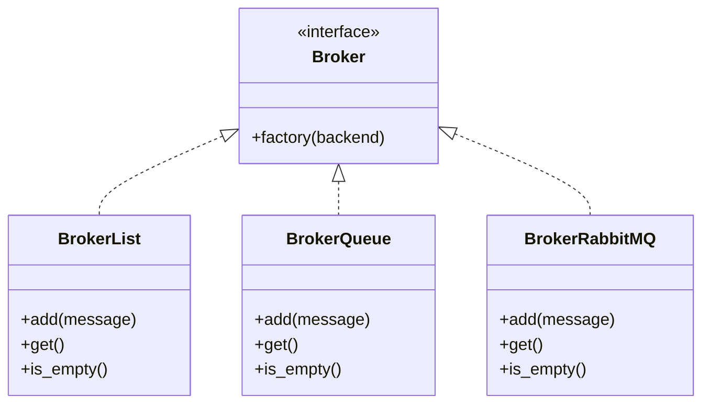
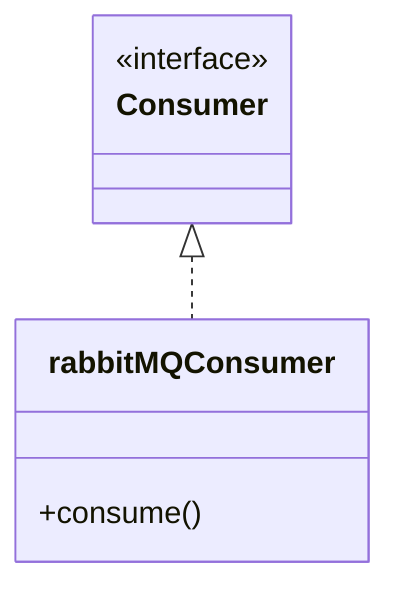

# A producer-consumer service for multi-sources data



## How to run
* Real-world sources:
```
docker compose --project-directory deploy --profile real-world up --build
```
* Simulate sources for offline testing:
```
docker compose --project-directory deploy --profile simulation up --build
```

## How to develop
1. Implement a `broker` from the provided interface.
2. Implement a `consumer` from the provided interface and define its docker
   image configuration.
3. Define the deployment via `docker-compose`.

## Repository tree
```
.
├── build
│   └── a given service
│       ├── Dockerfile
│       └── requirements.txt
|
├── deploy
│   └── docker-compose.yml
|
└── src
    ├── analyst: an example of complex consumer
    │
    ├── commons: definitions shared by more than one service
    │
    ├── interfaces: definitions of services to be made concrete
    │
    ├── queue_logger: an example of simple consumer
    │
    └── server: for simulations
```


## Interfaces
### Listener


### Broker


### Consumer
