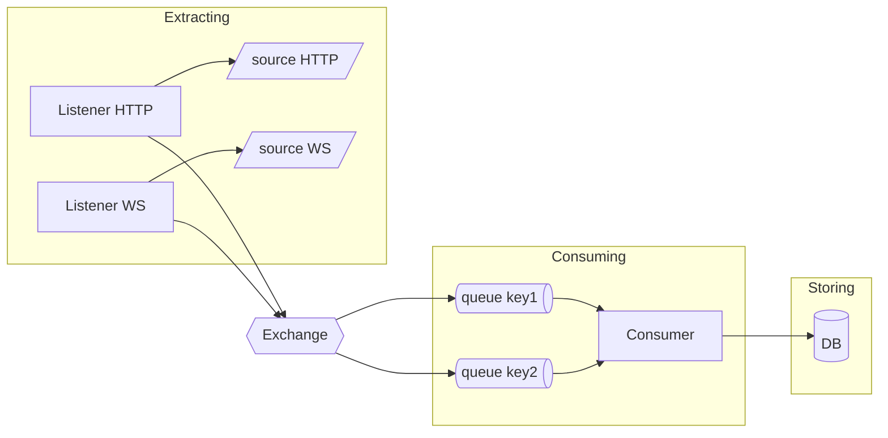
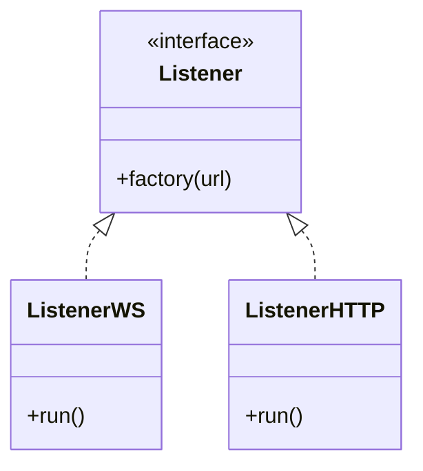
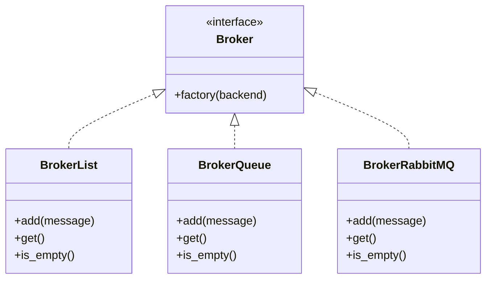
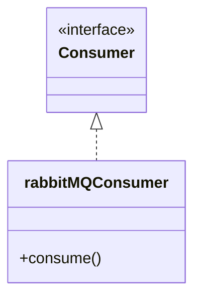

# A producer-consumer service for multi-sources data


## How to run
* Real-world sources:
```
docker compose --profile real-world up --build
```
* Simulate sources for offline testing:
```
docker compose --profile simulation up --build
```

## Components
### Listener


### Broker


### Consumer

