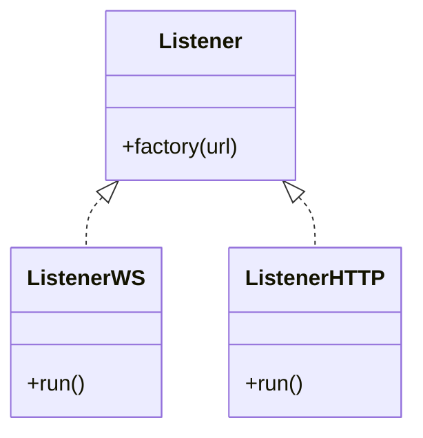
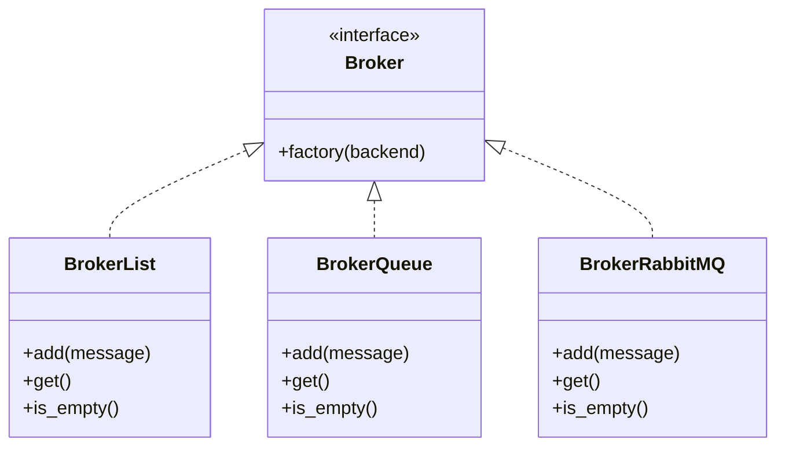

# A producer-consumer service for multi-sources data


## How to run
* Real-world sources:
```
docker compose --profile real-world up --build
```
* Simulate sources for offline testing:
```
docker compose --profile simulation up --build
```

## Architecture

### Repository tree
```
.
├── build
│   └── a given service
│       ├── Dockerfile
│       └── requirements.txt
|
├── deploy
│   └── docker-compose.yml
|
└── src
    ├── analyst: an example of complex consumer
    │
    ├── commons: definitions shared by more than one service
    │
    ├── interfaces: definitions of services to be made concrete
    │
    ├── queue_logger: an example of simple consumer
    │
    └── server: for simulations
```


## Relevant structures
### Listener


### Broker

