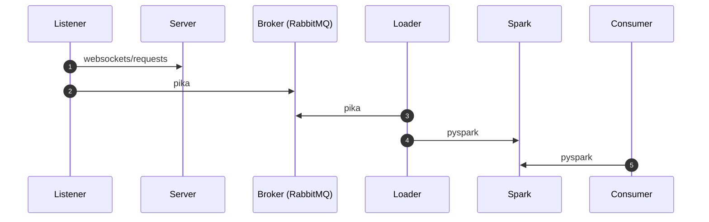

### how to run
```
docker compose --profile multiprocess up --build
```
### sequence diagram

```mermaid
sequenceDiagram  autonumber
  Listener ->> Server: websockets/requests
  Listener ->> Broker (RabbitMQ): pika
  Loader ->> Broker (RabbitMQ): pika
  Loader ->> Spark: pyspark
  Consumer ->> Spark: pyspark
```