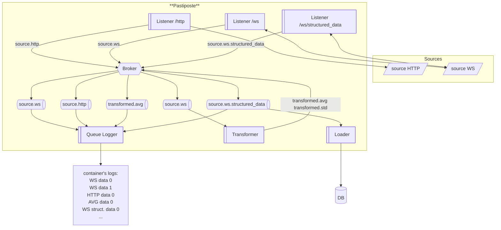
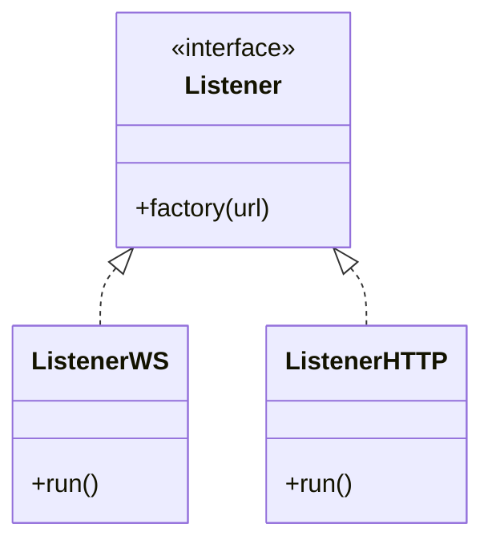
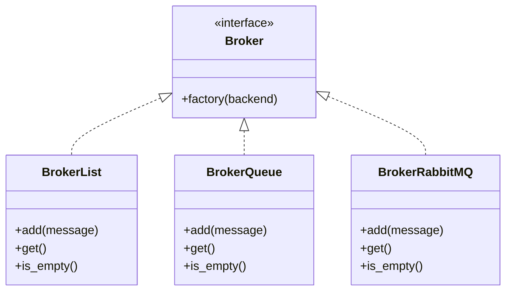
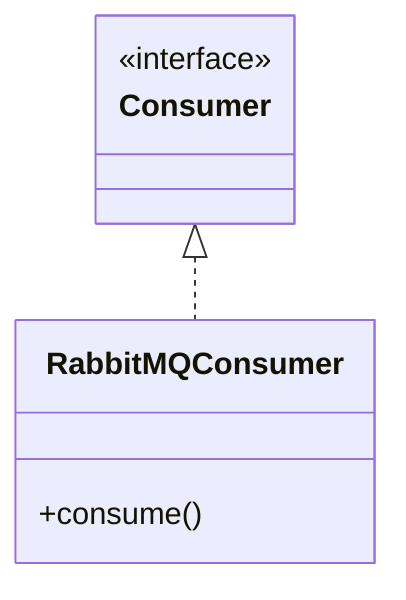

# A producer-consumer service for multi-protocol sources

## Description
A `Server` exposes endpoints for different communication protocols to produce
data of various kind. A `Listener` fetches such data according to the protocol,
and pushes it to a message passing `Broker` facility. One or more `Consumer`s 
access the data to operate on it.

In the here presented implementation:
* The endpoint `/ws` produces a list of Normally distributed floats.
* The endpoint `/ws/structured_data` produces random values based on a SQL model as defined in `src/models`.
* The endpoint `/http` produces a scalar character uniformely distributed.
* The `Broker` is an instance of RabbitMQ.
* A consumer `Queue Logger` retrieves data from the broker and logs it.
* A consumer `Transformer` evaluates some statistics on some of the data, and
sends it back to the broker.
* A consumer `Loader` store the structured data into a DB.

```mermaid
flowchart TD
  subgraph Sources
  sourceHTTP@{ shape: lean-r, label: "source HTTP" }
  sourceWS@{ shape: lean-r, label: "source WS" }
  end

  subgraph **Pastiposte**
  listenerHTTP@{ shape: lin-rect, label: "Listener /http" }
  listenerWS@{ shape: lin-rect, label: "Listener /ws" }
  listenerWSStruct@{ shape: lin-rect, label: "Listener /ws/structured_data" }
  listenerHTTP -->  sourceHTTP
  listenerWS <--> sourceWS
  listenerWSStruct <--> sourceWS
  listenerHTTP -- source.http --> broker@{ shape: hex, label: "Broker" }
  listenerWS -- source.ws --> broker@{ shape: hex, label: "Broker" }
  listenerWSStruct -- source.ws.structured_data --> broker@{ shape: hex, label: "Broker" }

  broker --> q1@{ shape: das, label: "source.ws" }
  broker --> q2@{ shape: das, label: "source.http" }
  broker --> q3@{ shape: das, label: "source.ws" }
  broker --> q5@{ shape: das, label: "source.ws.structured_data" }
  broker --> q4@{ shape: das, label: "transformed.avg" }

  q1 & q2 & q4 & q5 --> QueueLogger@{ shape: lin-rect, label: "Queue Logger" }
  q3 --> Transformer@{ shape: lin-rect, label: "Transformer" }
  Transformer -- transformed.avg transformed.std --> broker
  q5 --> Loader@{ shape: lin-rect, label: "Loader" }
  end

  Loader --> DB@{ shape: db, label: "DB" }
  QueueLogger --> log@{ shape: rect, label: "container's logs:
  WS data 0
  WS data 1
  HTTP data 0
  AVG data 0
  WS struct. data 0
  ..." }
```


## How to run it
```
docker compose --project-directory deploy up --build
```

## How to develop
1. Implement a `broker` from the provided interface.
2. Implement a `consumer` from the provided interface and define its docker
   image configuration.
3. Define the deployment via `docker-compose`.

## Repository tree
```
.
├── build
│   └── a given service
│       ├── Dockerfile
│       └── requirements.txt
|
├── deploy
│   └── docker-compose.yml
|
└── src
    ├── commons
    │
    ├── interfaces
    │
    ├── queue_logger: a simple consumer logging the received messages 
    │
    ├── transformer: a consumer evaluating some statistics of incoming data
    |
    └── server: WS or HTTP sources
```


## Interfaces
### Listener

```mermaid
classDiagram
    class Listener
    <<interface>> Listener
    Listener <|.. ListenerWS
    Listener <|.. ListenerHTTP
    Listener: +factory(url)
    class ListenerWS{
        +run()
    }
    class ListenerHTTP{
        +run()
    }
```

### Broker

```mermaid
classDiagram
    class Broker
    <<interface>> Broker
    Broker <|.. BrokerList
    Broker <|.. BrokerQueue
    Broker <|.. BrokerRabbitMQ
    Broker: +factory(backend)
    class BrokerList{
        +add(message)
        +get()
        +is_empty()
    }
    class BrokerQueue{
        +add(message)
        +get()
        +is_empty()
    }
    class BrokerRabbitMQ{
        +add(message)
        +get()
        +is_empty()
    }
```

### Consumer

```mermaid
classDiagram
    class Consumer
    <<interface>> Consumer
    Consumer <|.. RabbitMQConsumer
    class RabbitMQConsumer{
        +consume()
    }
```